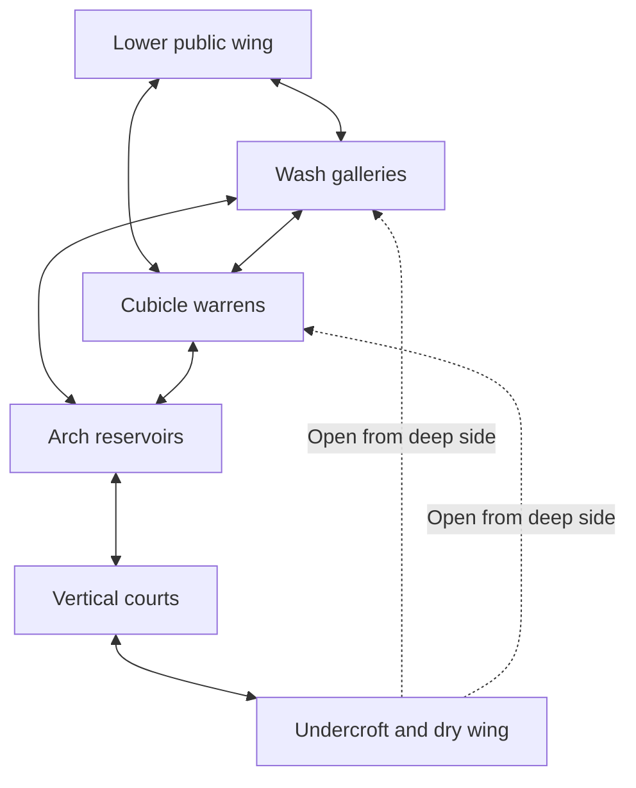

# ASHFALL — The Lower Restrooms

> **Beta 0.2.8 current implementation:** The Drowned Hollow is the single rare presence: a large, bloated, waterlogged biped with its approved hollow face, closed belly, empty hands and a slower melee charge. Its large dark reservoir locations remain. The earlier no-enemy and hospital-return rules below are historical: the Transfer is flooded with continuous doorways, the bottom stair commits the descent, and the deep sewer joins the outdoor campaign. The original architectural scope and research rationale are preserved below.

## A complete chapter for the next build

Research and revised implementation plan · 13 September 2026 · Based on the inspected beta 0.2.3 source and its saved render captures

**The next review build should deliver the complete flooded restroom chapter: 84 substantial authored spaces, six architectural districts, six connected floor strata, a substantial route out, and finished atmosphere throughout.** Internal engineering milestones are useful, but another small architectural sample would not satisfy this request.

This document replaces the previous proposal, including its staged delivery sections. It is a plan, not a claim that this expanded chapter has been implemented. The existing beta 0.2.3 files remain the last built release. The Transfer and campaign integration requirements survive this revision; the restroom scope and delivery commitment below supersede the earlier prototype-first handoff practice.

The intended feeling is: *I came down one flight to a restroom. I have been walking through bathrooms for a long time. This place has structure, maintenance, and an apparent purpose, but there cannot be this much building beneath the hospital. Something might share it with me. Nothing ever confirms that fear.*

## 1. What the research changes

Backrooms accounts are collaborative fiction, with different interpretations rather than one authoritative geography. The current Wikidot Level 0 is a credited rewrite, not the original anonymous post. Its fictional accounts help establish a design language; they are not reports of real events. [Backrooms Wiki](https://backrooms-wiki.wikidot.com/), [Canons](https://backrooms-wiki.wikidot.com/canons), [Level 0 — Threshold](https://backrooms-wiki.wikidot.com/level-0).

| Source actually read | Relevant observation | Decision for ASHFALL |
| --- | --- | --- |
| [Level 0 — Threshold](https://backrooms-wiki.wikidot.com/level-0) | Familiar institutional interiors, repetition and electrical ambience become unreliable; ordinary architecture supplies the baseline. | Start with convincing public washrooms. Establish recognizable rooms and connections before selectively violating them. |
| [Level 37 — Sublimity](https://backrooms-wiki.wikidot.com/level-37) | Tiled aquatic architecture exceeds a useful human purpose. The fiction combines calm and unease, abnormal acoustics, and an absence of recorded entities or other wanderers. | Preserve the empty, flooded architectural experience. There is no requirement to add a monster, survival meter, or explanation. |
| [POOLS — developer description](https://store.steampowered.com/app/2663530/POOLS/) | The developer explicitly excludes chasing and sudden attacking monsters, emphasizing exploration, room-dependent echoes, and the discomfort of exposed, dark or confined spaces. | Room acoustics, material changes and spatial contrast must be core content. A global horror hum cannot carry a whole chapter. |
| [Dreamcore — developer description](https://store.steampowered.com/app/2453060/Dreamcore/) | Its Dreampools description moves between tight passages and grand chambers, with unsettling connections and reflection. | Compose transitions between bodily compression and overwhelming scale; avoid a uniformly oversized labyrinth. |
| [POOLS community discussion on itch.io](https://tensori.itch.io/pools) | One lost player asked for help with chapter four; the developer linked maps. The player later identified an unexpected hidden wall as the obstacle. This is an individual account, not a consensus. | Confusion should concern the building, not which arbitrary wall the game expects the player to press. Required exits need visible, learnable architectural cues. |
| [Player guide: maps for POOLS chapters 1–6, by dpeyri](https://steamcommunity.com/sharedfiles/filedetails/?id=3241370355) | The textual guide relies on landmarks, distinguishes comparatively linear chapters from complex multi-floor navigation, and describes difficulty representing the latter on a flat map. | Perceived vastness, route complexity and atmosphere are separate design tasks. Provide landmarks and real loops without requiring a perfect global mental map. |

These are influences and our design inferences. We are creating an original hospital restroom chapter, rather than reproducing a wiki level or importing someone else's layout. The guide's text was read; its map images were not used to reconstruct routes. The games' developer descriptions are useful statements of intent, not independent measurements of their effects on every player.

The resulting principles are concrete:

1. **The place must seem to have existed before the player arrived.** Plumbing, cleaning access, worn thresholds and inconsistent renovations supply a mundane history without explanatory notes.
2. **Its purpose must become excessive.** The same fixtures serve more rooms, floors and empty capacity than any hospital could require.
3. **The player must form expectations worth breaking.** A known window, stair core or damaged basin makes one impossible return more disturbing than constant random rearrangement.
4. **Emptiness needs composition.** Open views, occluded side passages, sound decay and long sightlines make absence tangible. Darkness alone does not.
5. **No attack is the outcome, not an excuse for inactivity.** Exploration reveals architecture, changes the player's understanding, and opens new connections. No chase arrives to resolve the tension.

## 2. Why beta 0.2.3 falls short

The previous delivery concentrated on proving systems. It did not deliver the scope or sustained experience requested. This is the central mismatch; merely adding a handful of rooms or making the water darker would repeat it.

The following findings come from source inspection and existing saved render captures, not a new browser playthrough or real-device test.

| Current implementation | Why it matters |
| --- | --- |
| Twelve substantial rooms across B1 and B2; one main reservoir and one upper gallery. | A useful architectural sample cannot communicate the intended long, complex descent. |
| A direct route reaches the temporary service exit while bypassing the reservoir, upper gallery and only spatial fold. | A player can miss nearly everything that is supposed to define the chapter. |
| Much of the layout consists of open rectangular shells with sparse fixtures and a small shared tile palette. | The room outline changes more than its functional arrangement, material character or history. |
| Illumination is largely scalar and does not account for room occlusion; the stored warm-light setting does not tint surrounding illumination. | Lighting cannot yet reliably distinguish warm exposed chambers, cold ordinary rooms and deep shadowed bays. |
| The water layer is an opaque tiled surface with selected reflected geometry. | It does not adequately communicate submerged floors, varying depth and architecture continuing beneath the waterline. |
| One global hum, synthesized non-positional drips and broadly shared reverb. | The ear receives little evidence of new volumes, distant rooms or separated floors. |
| The spatial fold uses a short dark fade without a continuous view or an unmistakable spatial landmark. | It can read as a teleport effect rather than a contradiction the player discovers. |
| No durable campaign resume; the return is a temporary development exit. | The chapter lacks the infrastructure and conclusion needed for a long exploration. |

The saved reservoir render has readable arches and reflections, but relatively uniform illumination and tile treatment. Its geometry is a foundation, not a completed atmosphere benchmark. Fixture proportions also need review: the current basin rim is almost at the camera's eye height. That is a possible contributor to an artificial bodily scale, not a conclusion from a fresh playtest.

Retain the useful work: the existing left-corridor entry, separate restroom scene ownership, continuous stairs and height movement, polygon geometry, depth rendering, ordinary backward movement, campaign discovery branch and stationary Warden disappearance. These systems should support the new chapter rather than become its entire deliverable.

## 3. The campaign contract

### The earlier Transfer

- An accidental entrance is available in either the first or second level. Completing one consumes both opportunities for that campaign run; a genuinely new run permits rediscovery.
- The long dark hall retains its special rule: forward or backward longitudinal travel advances toward the far end. Looking around, standing still and pushing into a side wall do not advance it. Camera control remains free.
- The Warden occupies a recessed shadowed corner beside and slightly before the exit. He is off the walking line, motionless, and separate from the exit's light.
- He disappears in place on approach, including when watched continuously. No step aside, turning to face the player, blocking, death response, or escape into another doorway.
- Nothing attacks. On return, the entrance is physically gone for the rest of the run. The player keeps actual health and ammunition.

This is an established dependency to preserve and verify, not a proposal to rebuild the Transfer again before starting the restrooms.

### After the Heart

Use the **existing hallway with its existing left/right junction**. Right remains the normal exit. At the far end of the current left dead end, provide the stair down to the separate restroom chapter. The first descent is one believable floor below the Heart; none of the new restroom rooms is added to the Heart arena.

When the Transfer was completed, the Warden guides left. Otherwise he follows the established right route. Each guide route ends at a fixed position off the path. Guiding stops before the disappearance begins; he fades in place. On the left route his final corner sits beside the stair entrance, where he can be noticed without becoming a doorway obstruction. He is absent throughout the restrooms.

Before committing to the descent, the normal exit remains usable. Past the first restroom vestibule, the branch becomes a full journey with its own eventual return. Remove contradictory objective arrows pointing toward the old exit while the player follows the left invitation. Keep pause and navigation assistance available.

The restroom conclusion rejoins the established hospital departure once. It does not restart the Heart, grant duplicate completion rewards, skip the outdoor sequence, or end the campaign early.

## 4. One-build scope

| Deliverable | Target for the next review build |
| --- | --- |
| Substantial authored spaces | **84**, with stable room IDs and an independently checked room ledger. |
| Districts | **Six**, all traversable, dressed, lit and given distinct sound treatment. |
| Vertical extent | **Six floor strata, B1–B6**, entered through the ordinary one-floor descent. Multiple districts span several strata. |
| Major architecture | Four different reservoir halls; three different enclosed courts; at least one court with three reachable levels and another with four. |
| Spatial contradictions | Six authored architectural impossibilities, plus two restrained sensory incidents. Defined individually below. |
| Route structure | Branching approaches, local and cross-district loops, persistent shortcuts, substantial optional wings, and a full final return. |
| Exploration envelope | Target **40–60 minutes for an unfamiliar first route** and **75–120 minutes for thorough exploration**. These are tuning estimates to measure, not promises inferred from room count. |
| Completion quality | Final material, water, lighting and sound treatment across every district; reliable Continue/resume; integrated mobile controls; full campaign return. |

A room is a meaningful architectural volume or independently organized suite. Individual stalls, decorative doors, unreachable windows, tiny connector vestibules and additional balconies around the same open court do not inflate the count. A court counts once; its genuinely enclosed surrounding rooms can count separately.

The duration must come from useful exploration, real distance and changing spaces. Do not achieve it by reducing movement speed, mandatory waiting, repeated identical loops, or requiring every room to be visited. A knowledgeable repeat player may leave much faster.

The chapter should exceed each prior individual level in accessible architectural extent, meaningful connections and vertical traversal. Count and compare those properties during authoring. Do not claim it is larger merely because it has more named map entries.

## 5. The place we are building

### District allocation

| District | Rooms | Architecture and composition | Signature spaces |
| --- | ---: | --- | --- |
| **Lower public wing** | 12 | B1 arrival: six institutional washroom suites, two shower/changing suites, two staff washrooms and two substantial wash halls. Ordinary scale, low ceilings, beige tiles and turquoise partitions. | A convincing first restroom; a room wrapped around a stair core; a shower suite whose last opening reveals an unreasonable depth. |
| **Wash galleries** | 18 | Eight long or bent galleries, four paired wash suites, three light-well rooms and three shared wash chambers across B1–B3. Pale tiles, long sink rhythms, alternating dry and flooded floors. | A 70-metre sink gallery; a U-shaped room around an inaccessible-looking light well; a bright flooded chamber with rectangular shafts of light. |
| **Cubicle warrens** | 16 | Eight dense stall suites, four offset urinal/wash suites, two wedge rooms and two compact shower halls across B2–B4. Close partitions, uneven renovations, low service soffits and several tight routes. | A turquoise suite narrow enough to feel intimate without snagging controls; a deeper-than-possible final stall; a quiet irregular washroom with three believable exits. |
| **Arch reservoirs** | 16 | Four major halls, eight perimeter wash/shower suites and four enclosed drainage chambers across B3–B5. Different column plans, tile vaults, submerged fixtures and raised routes. | A long three-aisle arcade; a broad offset-column basin; a horseshoe reservoir; a darker hall with a traversable diagonal gallery. |
| **Vertical courts** | 12 | Three large court volumes and nine enclosed washrooms or landing halls around them, spanning B2–B6. Real stairs, bridges, overlooked rooms and stacked openings. | A tall narrow shaft court; a broad asymmetric flooded court; a terraced court whose far lit room is reachable several floors later. |
| **Service undercroft and dry wing** | 10 | Four substantial pipe/drain halls, three maintenance wash suites and three dry institutional rooms across B4–B6. Angular routes, back-of-fixture construction and a return to modest scale. | A passage revealing the backs of familiar sink walls; a large drain intersection; the final ordinary dry restroom containing the return cubicle. |
| **Total** | **84** | Connectors and individual cubicles are additional traversal elements. | Every district has recognizable spaces beyond its repeated kit. |

Dimensions above describe intended perceived scale. Establish a consistent conversion to the engine's world units first. Human-sized fixtures must stay human-sized, even inside impossible volumes.

### Architecture that earns its contradictions

Design locally as a real institution: reasonable door clearances, consistent fixture height, usable stall proportions, plumbing stacks, cleaning access, drainage falls, column support, stair headroom and believable landings. A service route should usually run behind something it services. Renovations can explain an offset wall or an awkward leftover room.

Use rectangles, L and U plans, wedges, octagons, gently curved galleries, split levels and asymmetric courts. Different outlines also need different internal arrangements. One empty octagon surrounded by many empty boxes does not provide adequate variety.

About two thirds of the rooms should establish or extend understandable architecture. Exact repeating suites are deliberate exceptions within larger architectural families. Unique landmarks interrupt repetition often enough for players to remember where they have been.

Monumental spaces need inhabitable edges: washrooms embedded in their perimeter, bridges with supports, side galleries, balcony doors and visible stairs. At least two distant illuminated destinations seen early must later be physically reachable. Additional inaccessible repetition can extend the impression of scale, but cannot substitute for the promised playable space.

### The route graph

This shows first-pass circulation between districts, not a literal floor plan. Each connection represents several authored rooms and often more than one route.

The first discoverable exit route must pass through a reservoir and the court system. The required court crossing contains the clearest spatial contradiction. These essential experiences cannot sit exclusively in optional side rooms again.

In that court, the ordinary main stair serves the lower three landings. The fourth landing and the onward dry-wing route are first reached through the level passage with the wrong-height connection. From above, the player can open a maintenance-stair shortcut back to the known lower floors. This preserves a real, inspectable height reference and later backtracking without letting an ordinary stair bypass the first encounter with the contradiction.

Within that progression, offer alternatives: two approaches to the reservoirs; different routes around water; multiple stair cores; optional repeated suites; cross-court bridges; service routes that reconnect to previously known places. At least six substantial local loops and three cross-district loops must survive the final route audit.

The undercroft's early-looking service doors connect from the deep side later. They use coherent latches and persistent door state, not collectible keys or invisible progress gates. Once opened, shortcuts stay open. The final dry wing is reached through the deep court/undercroft route; an arrival-area staff doorway must not expose it immediately.

## 6. A representative first journey

This is an authored experience outline, not a timed cutscene or a script that steals movement.

**Arrival: the believable restroom.** The player descends from the existing left corridor. The Warden's corner is empty. Beyond a short bend is an ordinary washroom: sinks opposite stalls, a discoloured dispenser, one failed fluorescent, a shallow puddle. The boss music remains gone. The first few rooms could actually belong downstairs in this hospital.

**Expansion: too much of the same function.** The rear wash passage reaches another suite. It has the same sink arrangement but a different door beyond it. A second route shows a familiar broken basin through a wire-glass opening. The player can test ordinary backtracking and it works. Then a stall-side opening reveals an implausibly long wash gallery, with a light far beyond the scale of the room they entered.

**Exposure: nowhere for an attacker to hide, yet nowhere comfortable to stand.** A narrow passage opens into a bright flooded tiled chamber. Submerged grout and the edges of steps are visible. Light appears to come from a high opening, but no exterior is visible. The space is empty and unusually quiet. It offers two clear onward openings, so uncertainty is about where they lead rather than whether the player missed a switch.

**Compression: the private maze.** One route threads turquoise partitions, urinal bays, angular suites and back-of-fixture passages. The player's footsteps become intimate. A row of mirrors reflects the local room convincingly. A deep cubicle opens into a volume that cannot fit behind it. Nothing appears in a mirror or lunges from a stall.

**Monumental revelation: the flooded arches.** The ceiling suddenly rises. A long, dark arcade opens across several bays. The nearest route is readable in reflected light; lateral aisles recede into darkness. Movement across water is comfortable. A small lit washroom far across the hall is an actual destination. Several ordinary rooms interrupt the major halls, preventing one continuous giant chamber from flattening their impact.

**Orientation breaks: the courts.** The player sees stacked restroom openings above a flooded floor. A real stair takes them up; they can look back across the route they walked. Later, a flat connecting passage reaches a balcony several floors away in the same identifiable court. The same cracked column and hanging pipe prove the relationship. Looking back and retracing remain possible. This is the strongest compulsory contradiction.

**Exhausted familiarity: the dry wing.** Service passages finally explain parts of the building—pipes behind known sinks, drainage beneath earlier water—while one relationship still refuses to fit. The route contracts into dry, ordinary washrooms. There is no triumphant light, objective fanfare or promise of a boss.

**Departure: an ordinary door.** A plain restroom contains the final return cubicle. Its door is already visibly ajar and softly lit, so escape does not require testing every stall. Passing through it returns to the hospital approach to the established exit. Looking back shows an ordinary service recess. No ambush or explanatory Warden appearance follows.

The essential rhythm is familiar → excessive → exposed → compressed → monumental → impossible → familiar again. Alternative paths change the order of smaller discoveries without removing the chapter's defining experiences.

## 7. Six spatial contradictions and two sensory incidents

Each architectural contradiction requires a stable source/destination relationship, a visual witness to the impossibility, authored reverse behavior and persistent state. Use doorway bends or matching vestibules to conceal transitions where necessary. Do not use a blackout, camera snap or random room regeneration to announce the mechanism.

| Event | What the player notices | Implementation contract |
| --- | --- | --- |
| **1. The room behind the stall** | An ordinary final cubicle opens into a long wash hall that cannot fit behind the suite's thin back wall, previously seen from its service side. | Fixed connection in both directions. Keep the cubicle and adjoining service wall recognizable. The opening has normal collision and is visibly traversable. |
| **2. The same damaged basin** | A route around a service core reaches the original chipped basin room from a direction that should belong to a different wing. | Return to the same persistent room, not a reset copy. Door state and a distinctive fixture confirm identity. Ordinary adjacent connections stay stable. |
| **3. The wrong-height balcony** | A level passage connects two widely separated heights of one court, after ordinary stairs have established the actual vertical distance. | Fixed fold with reversible orientation and relative eye height. The cracked column and hanging pipe remain visible witnesses. This event lies on the first-pass exit route. |
| **4. The gallery that cannot fit** | A long curved wash gallery follows a tiny central service core whose size can be checked from both ends. | Author a stable spatial fold within the curve. Seamless movement, material rhythm and sound continuity must survive reversal and strafing. |
| **5. The incompatible reservoirs** | A short ordinary vestibule connects two large halls whose visible footprint and shared perimeter landmarks should make their volumes overlap. | Keep both halls stable. The junction is inspectable from their perimeter routes; use one documented connection transform rather than global rearrangement. |
| **6. The returning descent** | Two genuine descending stair flights reach a door opening onto a known upper washroom, at its original height relative to its court. | The stairs remain ordinary and traversable. An occluded landing carries the fixed spatial transition. The return route works consistently after saving and loading. |
| **7. The room without an echo** | After several resonant tiled rooms, the player's steps abruptly sound close and dry in a large chamber. | Local acoustic zone with a soft threshold. Do not change movement, camera or master volume. It remains quiet on repeat visits. |
| **8. The displaced drip** | A pipe and its visible drip are overhead; one localized sound seems to continue from beyond a sealed partition. | One restrained authored acoustic mismatch, distinct from a broken global panner. It never becomes footsteps chasing the player or a rising threat sequence. |

A player should be able to describe what is impossible without being told the word “Backrooms.” Keep several coherent rooms between major violations. The building is learnable, even where its global arrangement is impossible.

## 8. Visual, material and sound direction

### Use the supplied references as a range

| User reference | Translation into this chapter |
| --- | --- |
| `IMG_0303.png`: ordinary dim restroom | Credible first rooms, opposing sinks and stalls, a low ceiling and limited visibility around everyday objects. |
| `IMG_0304.png`: cramped turquoise cubicle | Intimate scale, worn partitions and uncomfortable proximity. Small rooms are complete compositions, not filler closets. |
| `IMG_0302.png`: repeated sinks | Excessive institutional rhythm and long perspective, interrupted by identifiable basins, bends and side suites. |
| `IMG_0305.jpeg`: bright flooded tile hall | Warm pale surfaces, visible submerged floor, clear light shafts and exposed emptiness. This contrast is essential. |
| `IMG_0307.jpeg`: dark flooded arches | Strong arch silhouettes, deep lateral shadow, restrained highlights and water extending apparent depth. |
| `IMG_0306.jpeg`: tall flooded court | Stacked repetition and unsettling enclosure, translated into reachable restroom floors, galleries and real circulation. |

Use original architecture and assets. The screenshot interfaces and their text are not game textures or architectural evidence.

### Required art and rendering work

- Establish one ordinary eye/door/sink/stall/tile scale before expanding the kit. Reserve disproportional fixtures for a deliberate anomaly, if used at all.
- Add several sink and mirror families, toilets, urinals, operable stall doors, shower banks, pipes, traps, drains, dispensers, trim and institutional signs. Vary composition, age and renovation history by district.
- Make signs part of the wall plane with correct orientation, perspective and depth. Current camera-facing signs undermine the architectural effect.
- Give each district its own material and light palette: worn beige/turquoise, pale clinical tile, compressed blue-green, dark green vaults, pale tall courts and muted service concrete. Match colour and shading to local lights.
- Add room-aware illumination, occluded light contribution and contact shading. Bright floors can border dark recesses. A phone must still reveal floor edges, doorways, stairs and the next safe surface.
- Build water as a region with its own surface height, tint, visible submerged floor, depth change and waterline marks. Add restrained reflections of nearby architecture and light, with gentle distortion and movement ripples. Water must not look like a second opaque tile floor.
- Preserve dry ledges and ordinary steps into shallow water. Deep basins communicate inaccessible depth through geometry and readable boundaries; the chapter adds no drowning mechanic.
- Provide convincing local mirror response in selected focal rooms; tarnished or obscured mirrors can limit rendering cost elsewhere. Avoid uniformly black mirror panels masquerading as finished mirrors.

The goal is stronger composition and material evidence within ASHFALL's visual language. It is not a claim that this renderer will reproduce the photographic references exactly.

### Sound as architecture

**The player's latest sound requirement is part of the core deliverable:** walking in water must sound like walking in water; the large spaces must echo like an indoor pool or cavern; ambient silence and water sounds must vary by room. Replacing the current global hum with a different global loop would not meet this requirement.

#### Footsteps that belong to the surface

Trigger each footfall from actual resolved walking distance and cadence. Dry tile produces a restrained hard contact. A thin puddle adds a wet slap and small splash. Ankle-deep water produces a distinct foot entry, splash and short slosh as the foot leaves; slightly deeper wading adds more displaced water without becoming a continuous roar. Give successive steps subtle recorded or designed variations so repetition does not expose a short synthetic noise loop.

Choose the sound from the local floor and water region, not merely the district or B-floor label. Crossing from a raised dry ledge into shallow water must immediately change the next footstep. Walking backward and strafing produce the correct cadence; looking around, standing still, or pushing against a wall does not generate footsteps. Running changes cadence and force. When the player stops, the last splash and room echo decay naturally while new movement sounds stop.

The direct splash must remain recognizable before its reverberant tail. Long reverb alone cannot turn a generic noise burst into believable water. Use a dedicated water-footstep palette with contact, displacement and withdrawal details; review it against the theme before propagating it through the chapter.

#### A room-by-room sound plan

Each authored room records its ambient mode separately from its acoustic response. A room can have no ambient emitters while still strongly echoing the player's steps. “Silence” means the room stops supplying its own noise; it does not mute movement. Except for the single authored missing-echo incident, ambient silence never disables the room's reflections.

| Room family | What is audible when standing still | Response to player movement |
| --- | --- | --- |
| Ordinary arrival washrooms | Mostly quiet; a few individually placed fixtures may buzz or drip. Several rooms have neither. | Close, hard-tile reflections; dry steps change to small splashes only in actual puddles. |
| Bright flooded galleries | Either quiet water ambience or a sparse, localized drip. No compulsory electrical drone. | Clear splashes with a long, smooth indoor-pool echo that exposes the empty length. |
| Tight cubicle suites | Ambient silence in most suites; one nearby plumbing sound in selected rooms. | Intimate wet or dry contacts, short reflections, and audible changes when partitions open into a hall. |
| Arch reservoirs | Alternate very quiet halls with halls containing a distant drain, small water flow or occasional drops. | Broad pool/cavern reverberation: an immediate splash, separated spatial reflections, then a long fading tail. Avoid an undifferentiated wash of noise. |
| Tall courts | Sparse water far below, a remote outlet, or full ambient silence, according to the individual court. | Spacious vertical-sounding reflections and decay that distinguish the court from a low gallery. |
| Service rooms and final dry wing | Local pipe or drain sounds where the architecture supports them; increasingly quiet dry rooms toward the departure. | More confined reflections; ordinary dry contact returns as the water ends. |

Place emitters at real drain mouths, pipe ends, fixtures and water surfaces. Their direction and audibility follow nearby room openings; sounds behind a wall are muffled, and distant floors do not all play the same close drip. The one authored displaced-drip incident is a deliberate exception surrounded by otherwise reliable sound placement.

Give the larger rooms convincing early reflections and a long, spacious tail rather than routing every sound into the same reverb. Use at least six acoustic profiles, with room-level variations in size and absorption. Blend direct sound, obstruction and decay smoothly at thresholds; allow an outgoing echo to finish without dragging that room's ambience through the whole level. Silence, intermittent water and steady local water flow are all valid ambient modes, authored per room.

No post-Heart music bed, countdown, repeating threat swell, fake pursuit or repeated Warden breaths. Electrical hum is a localized fixture sound used sparingly. Water, the player's movement and the response of the architecture carry this chapter.

#### Required listening checks

- Walk, run, strafe, walk backward and stop across a dry ledge, puddle and flooded floor. The contact, cadence, splash strength and tail match the actual movement and surface.
- Compare a tight suite, bright gallery, reservoir and court with the screen hidden. Their size and wetness should be distinguishable through movement alone.
- Stand still in a designated silent room after all tails finish: there is no global hum, repeating drip or movement loop left running. Water-only rooms contain only their authored water ambience.
- Listen through an open doorway, behind a closed partition and from an upper floor. Nearby versus distant water remains understandable; the same emitter is not duplicated during sector changes.
- Check headphones and phone speakers. Small speakers must preserve the splash attack and useful echo cues; stereo effects must remain coherent in mono.
- Pause, background, rotate, resume and leave the chapter. No footsteps continue without movement, no audio layers multiply, and the boss soundtrack never leaks back in.

Listening on actual devices is a required review activity. Code inspection and the existence of a wet-footstep function cannot establish that the result fits the theme.

## 9. Exploration without chores or loss of control

Backward movement works normally throughout the restrooms. The Transfer's movement rule never leaks into this chapter. Keep camera motion, turning and door clearance comfortable on touch controls. Water changes sound and visual response; any movement drag is modest and cannot be used to manufacture playtime.

The player can open visible ordinary doors, test routes, revisit spaces, shoot with normal ammunition rules and leave without clearing every wing. No keys scattered as busywork, valve sequence, oxygen meter, sanity bar, compulsory notes or unseen damaging enemy is added.

Navigation uses local evidence: tile bands, partition colours, pipe diameters, known damage, court silhouettes and acoustics. Required doors must be visibly doors and interact with the established Use control. Decorative doors have consistent locked/maintenance treatment. Avoid a maze composed mainly of indistinguishable closed doors.

Retain a pause-accessed exploration sketch, upgraded for districts and six floors. It records observed local spaces and remembered connections, including impossible links as connections rather than pretending all rooms fit a metric overhead plan. It does not reveal unexplored rooms or mark the final answer immediately. An optional orientation aid can identify a reachable unvisited opening using local landmarks; it never changes topology or resets progress behind the player's back.

Preserve the mobile work already requested: landscape safe areas, compact controls, a clear central view, touch ownership, contextual Use and gameplay-scoped suppression of text selection, context menus, dragging and accidental page movement. Idle touch controls may dim but stay discoverable. Let the weapon settle lower during quiet traversal, returning immediately on aiming or firing. Do not shrink essential touch targets or add new swimming buttons.

## 10. Technical work that supports the full chapter

These implementation tasks follow from the inspected code. They are not claims that the proposed expanded world has already been profiled.

**Authored world data.** Move the layout into stable district/room/portal/fixture/water definitions. Each room records its shape, purpose, floor, ceiling, material set, entrances, landmark, acoustic profile and save ID. Maintain a separate connection ledger identifying ordinary doors, stairs, folds and deep-side shortcuts. Modular assets support authored layouts; random generation does not supply the chapter.

**Geometry and sectors.** Keep polygonal geometry and continuous height. Extend stairs beyond the current single-axis interpolation. Index faces, portals, collision and emitters per sector rather than filtering the complete world every frame. Build several-room sectors and real cross-height court visibility. Load or retain neighboring visible sectors as needed; preserve distant room state separately. Remove assumptions tied to only B1/B2 and the current fixed layout bounds.

**Continuous anomalies.** Specify source/destination transforms and reverse behavior in data. Use occluded, matching vestibules where a transition can be genuinely concealed. Where a player can see through a folded opening, render the transformed view or redesign the vestibule; a visible blackout is not a finished substitute. Position, facing, velocity, sound direction and collision must agree before and after crossing.

**Performance across the real layout.** Profile the worst court, reservoir and mirror arrangement before multiplying their details. The current full-face filtering, sorting and boundary comparisons are scaling risks. Build visibility and quality limits around the actual 84-room chapter. If the present renderer cannot meet the representative device budget after sectoring, resolve the renderer bottleneck internally; reducing the chapter to another short sample is not the fallback.

**Resume and campaign state.** Add versioned Continue checkpoints at stable room transitions and important connection changes. Persist the run identity, active scene, room/floor/pose, inventory, health, visited rooms, doors, shortcuts, anomaly state, Transfer completion, chosen Warden route and resolved Heart return state. Save references to authored data, not live render/audio objects. Keep the last valid checkpoint if a write is interrupted; handle unavailable storage visibly without claiming that progress was saved.

**Integration.** Suspend the Heart's simulation and unrelated triggers during the separate scene. Restore the correct campaign state once on departure. Preview fixtures remain isolated from the actual run. Preserve existing build ordering, original approved art/audio payloads and cue data. Exclude the scenic Warden from bullet collision as well as damage, melee, drops and enemy targeting.

## 11. Internal implementation order, one user-facing build

| Internal milestone | Work completed before moving on |
| --- | --- |
| **A. Full architecture** | Author all 84 room records, floor sections, major views and the complete route graph. Check ordinary construction, required reveals, optional wings and exit reachability. |
| **B. World foundation** | Establish fixture scale; sector indices; six-floor traversal; water regions; door state; persistent saves; continuous spatial connection support. Test the hardest court and fold internally. |
| **C. Complete playable chapter** | Construct every district, all major halls and courts, six spatial contradictions, loops, shortcuts and final hospital return. The full journey works end to end. |
| **D. Atmosphere throughout** | Complete composition, district materials, local lighting, water, mirrors, signage, local sound and sensory incidents across the entire route and optional wings. |
| **E. Experience and device review** | Fresh-player traversal, visual and listening review, save/reload checks, campaign regressions, real mobile landscape testing and targeted performance work. |
| **F. Review build** | Package one standalone HTML, one web ZIP and concise playtest notes documenting the full chapter and any verified limitations. |

These are work checkpoints within one iteration. Milestone B is not another 12-room deliverable. Milestone C's full-size unfinished shells are not the final experience either. If an essential requirement remains unresolved, report it concretely; do not relabel the sample as the completed vision.

## 12. Acceptance: what must be demonstrated

### Scope and circulation

- The ledger and traversable graph contain 84 substantial spaces across all six districts and six strata, excluding filler counts.
- Four distinct reservoir halls and three courts exist. Promised multi-floor routes and distant destinations are actually reachable.
- An unassisted first route encounters major flooded architecture, vertical architecture and the wrong-height contradiction before finding the final return.
- At least six local loops and three cross-district loops function. Opened shortcuts and ordinary routes stay stable across revisits and reloads.
- Measured first-time exploration supports the intended scale. If players escape immediately or spend most of their time checking arbitrary walls, revise circulation and cues rather than adding delay.

### Architectural and emotional experience

- Review every district from both normal walking and low landscape phone views. Check fixture scale, light contrast, real submerged floors, sign depth, stairs, collision and visual continuity at folds.
- Each district has at least three identifiable spaces that a player can describe by appearance or arrangement, without relying on a displayed district name.
- Ask fresh players to describe the place before telling them its inspirations. Can they identify a particular impossible relationship? Which rooms felt exposed, intimate, familiar or vast? Where did they expect an attack? Where did uncertainty become frustration?
- Record individual reactions rather than claiming that everyone will be terrified. The design succeeds when players notice coherent space becoming unreliable while remaining motivated to explore.
- No attacking encounter, final jump scare, forced camera movement or hidden resource failure is required to sustain the journey.

### Campaign, saving and input

- Complete the Transfer from both eligible chapters; test a run without finding it. Verify the correct Heart turn, the exact far-left stair entry and the unchanged normal right exit.
- Watch the Warden continuously during approach: fixed side-corner position, in-place disappearance, no collision response to fire and no reappearance after saving.
- Save and continue in every district, after each fold, after shortcuts open and around the final return. Inventory, known rooms, consumed entrances and campaign state remain correct.
- Pause, background, rotate, interrupt touches and resume on stairs and at portals. No stuck movement, accidental fire, selection, scrolling or duplicated ambience follows.
- Play representative long sections on actual iPhone Safari and Android Chrome in landscape, including changing browser chrome and safe areas. Aim for consistent 30 fps or better on the selected representative phones; record device, settings and worst scenes. Native harness timing and emulation do not establish this result.
- Verify the existing campaign, packaging and approved media remain intact. Stop broadening tests once concrete risks and required gates are covered.

## Decision

The next build is a full, authored descent beneath the hospital. Its ambition comes from the relationship between its rooms: convincing local architecture, escalating excess, real vertical exploration, carefully witnessed impossibility and an unresolved absence of danger. The systems already built are the starting point. The next deliverable must finally make them add up to the place described here.
